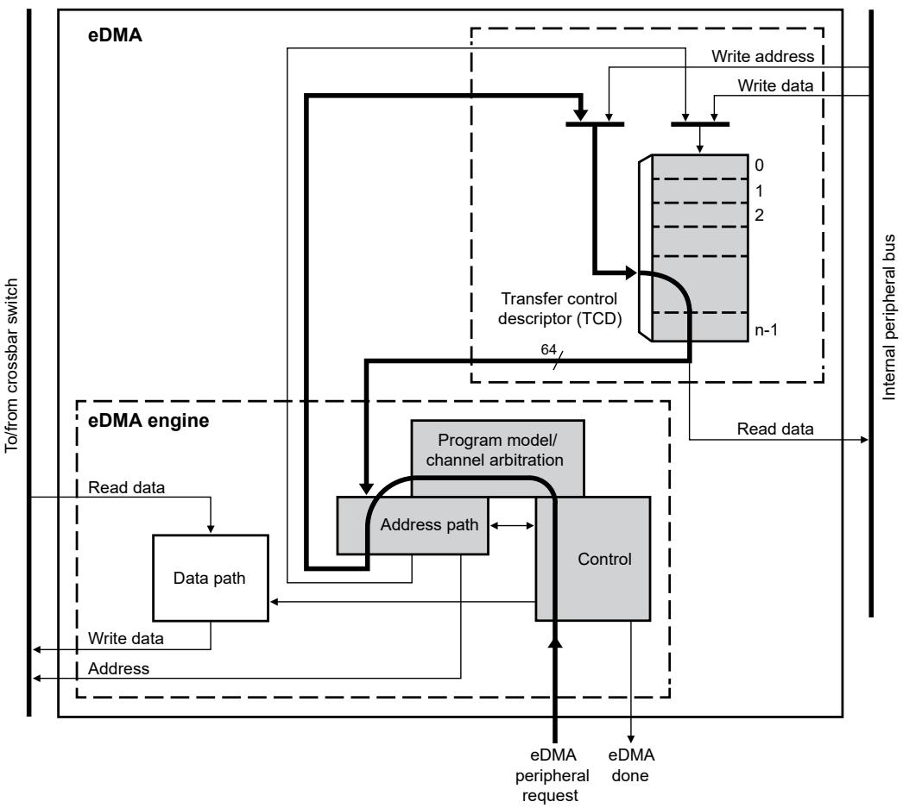
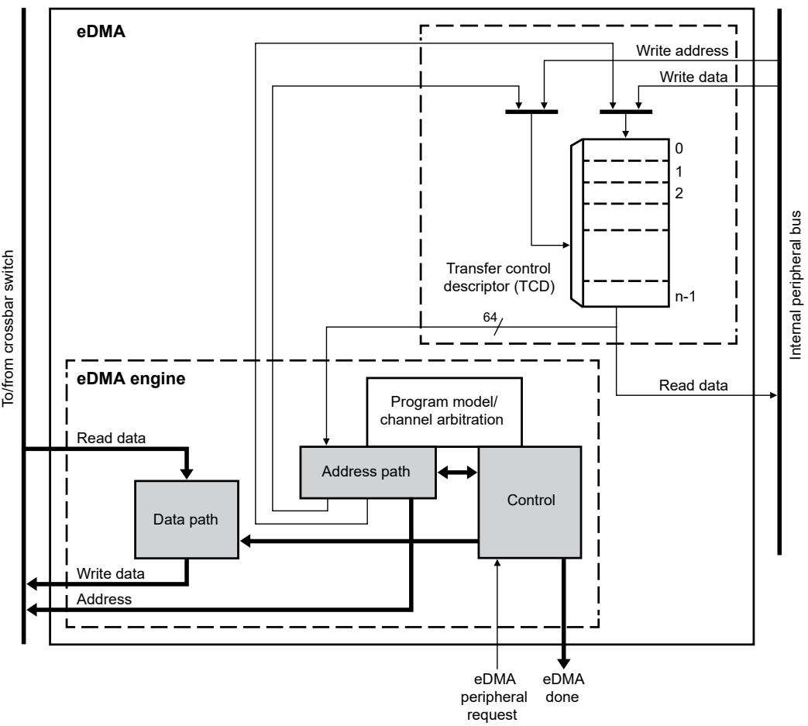
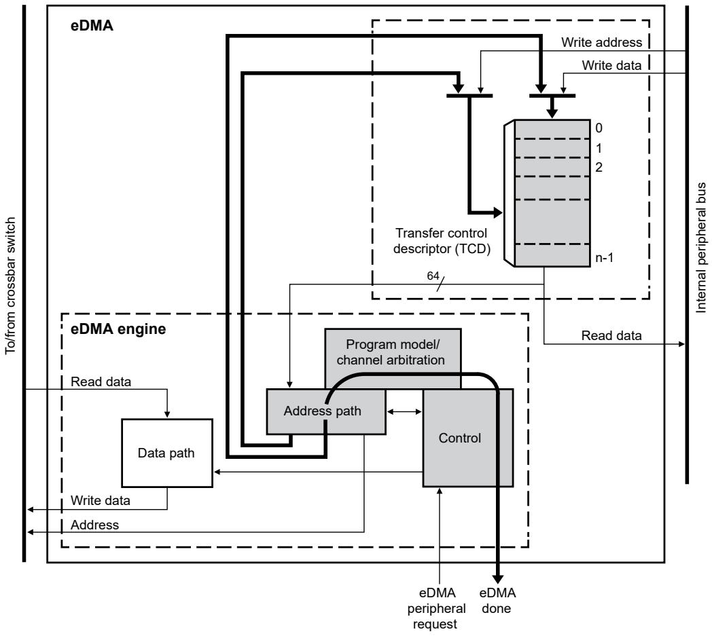

## 23.3.2 eDMA basic data flow

The basic flow of a data transfer can be partitioned into three segments. 

As shown in the following diagram, the first segment involves the channel activation: 

Figure 105. eDMA operation, part 1

This example uses the assertion of the eDMA peripheral request signal to request service for channel n. Channel activation via software and the TCDn_CSR[START] field follows the same basic flow as peripheral requests. The eDMA request input signal is registered internally and then routed through the eDMA engine: first through the control module, then into the program model and channel arbitration. 

In the next cycle, the channel arbitration begins using fixed-priority plus the optional round-robin algorithm. After arbitration is complete, the activated channel number is sent through the address path and converted into the required address to access the local memory for TCDn. Next, the TCD memory is accessed and the required descriptor is read from the local memory and then loaded into the eDMA engine address path's primary or secondary channel execution registers. The TCD memory is 64 bits wide to minimize the time needed to fetch the activated channel descriptor and load it into the address path registers. 

The following diagram illustrates the second part of the basic data flow: 

Figure 106. eDMA operation, part 2

The modules associated with the data transfer (address path, data path, and control) go through the required sequence of source reads and destination writes to perform the actual data movement. The source reads are initiated, and the fetched data is temporarily stored in the data path block until it is gated onto the internal bus during the destination write. This source read/destination write processing continues until the byte count, NBYTES, has been transferred. 

After NBYTES of data has been moved, the final phase of the basic data flow is performed. In this segment, the address path logic performs the required updates to certain fields in the appropriate TCD (for example, SADDR, DADDR, CITER). If the major iteration count is exhausted, additional operations are performed. These include the final address adjustments and reloading of the BITER field into the CITER field. Assertion of an optional interrupt request also occurs at this time, as does a possible fetch of a new TCD from memory using the scatter/gather address pointer included in the descriptor (if scatter/gather is enabled). The updates to the TCD memory and the assertion of an interrupt request are shown in the following diagram. 

Figure 107. eDMA operation, part 3

