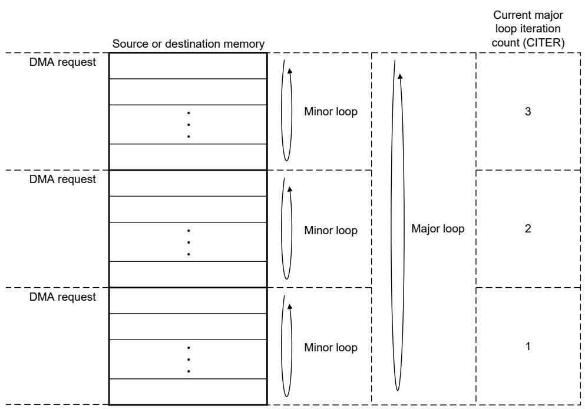
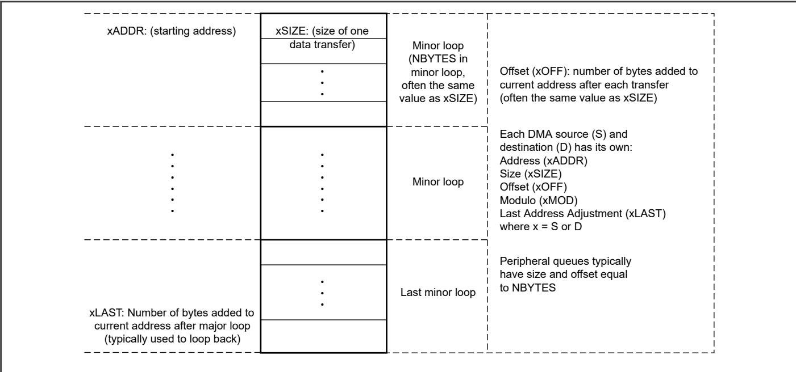

## 23.5.1 eDMA initialization

To initialize the eDMA: 

1. Write to the MP_CSR if a configuration other than the default is wanted. 

2. Write the channel priority levels to the CHn_PRI registers and group priority levels to the CHn_GRPRI registers if a configuration other than the default is wanted. 

3. Enable error interrupts in the CHn_CSR[EEI] registers if they are wanted. 

4. Write the 32-byte TCD for each channel that may request service. 

5. Enable any hardware service requests via the CHn_CSR[ERQ] registers. 

6. Request channel service via either: 

• Software: setting TCDn_CSR[START] 

• Hardware: slave device asserting its eDMA peripheral request signal 

After any channel requests service, a channel is selected for execution based on the arbitration and priority levels written into the programmer's model. The eDMA engine reads the entire TCD, including the TCD control and status fields, as shown in Table 297, for the selected channel into its internal address path module. 

As the TCD is read, the first transfer is initiated on the internal bus, unless a configuration error is detected. Transfers from the source, defined by TCDn_SADDR, to the destination, defined by TCD_DADDR, continue until the number of bytes specified by TCDn_NBYTES are transferred. 

When the transfer is complete, the eDMA engine's local TCDn_SADDR, TCDn_DADDR, and TCDn_CITER are written back to the main TCD memory and any minor loop channel linking is performed, if enabled. If the major loop is exhausted, then eDMA executes further post-processing, such as interrupts, major loop channel linking, and scatter/gather operations, if enabled. 

Table 297. TCD control and status (TCDn_CSR) fields

<table><tr><td>TCDn_CSR field name</td><td>Description</td></tr><tr><td>START</td><td>Control field to start the channel explicitly when using a software-initiated DMA service (automatically cleared by hardware)</td></tr><tr><td>EEOP</td><td>Control field to enable end-of-packet processing</td></tr><tr><td>ESDA</td><td>Control field to enable storing of the destination address to system memory after the major loop completes</td></tr><tr><td>DREQ</td><td>Control field to disable hardware-initiated DMA service requests after major loop completion</td></tr><tr><td>BWC</td><td>Control field for throttling the bandwidth control of a channel</td></tr><tr><td>ESG</td><td>Control field to enable the scatter-gather feature</td></tr><tr><td>INTHALF</td><td>Control field to enable interrupt when major loop is half-complete</td></tr><tr><td>INTMAJOR</td><td>Control field to enable interrupt when major loop completes</td></tr></table>

Table 298. Channel control and status (CHn_CSR) fields

<table><tr><td>CHn_CSR field name</td><td>Description</td></tr><tr><td>ACTIVE</td><td>Status field indicating the channel is currently in execution</td></tr><tr><td>DONE</td><td>Status field indicating major loop completion (cleared by software when a channel begins execution)</td></tr><tr><td>EEI</td><td>Control field to enable error interrupts</td></tr><tr><td>EARQ</td><td>Control field to enable external, asynchronous wakeup event in conjunction with the ERQ field</td></tr><tr><td>ERQ</td><td>Control field to enable hardware service requests</td></tr></table>

The following figure shows how each DMA request initiates one minor-loop transfer, or iteration, without CPU intervention. DMA arbitration can occur after each minor loop, and one level of minor loop DMA preemption is allowed. The number of minor loops in a major loop is specified by the beginning iteration count (BITER). 

Figure 108. Example of multiple loop iterations

The following figure lists the memory array terms and how the TCD settings are related.

Figure 109. Memory array terms

