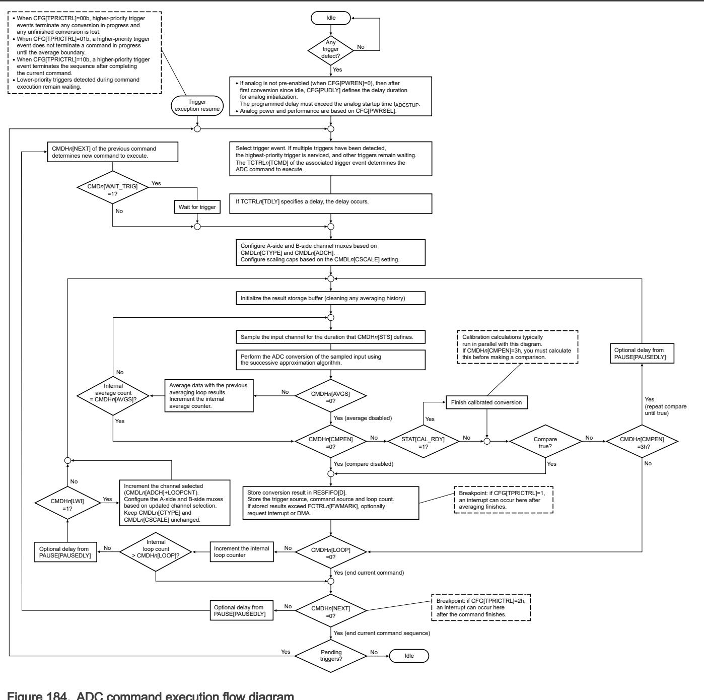

## 41.3 Functional description

ADC performs analog-to-digital conversions on any of the software-selectable analog input channels via a successive approximation algorithm. 

The ADC module can average the result of multiple conversions on a channel before storing the calculated result. The hardware average function is enabled by setting CMDHn[AVGS] to a non-zero value. The function operates in any conversion mode or configuration. 

ADC can compare the result of a conversion with the contents of two value registers for less-than, greater-than, inside-range, or outside-range detection. The compare function operates in any conversion mode or configuration. 

When the conversion and averaging loops finish, the resulting data is placed in one of 2 available FIFO data buffers . The data includes tag information associated with the result. When the number of stored data words exceeds the setting, a configurable watermark level supports interrupts or DMA requests. Interrupts can also be enabled to indicate when FIFO overflow errors occur. 

The module initializes to its lowest power state during reset. 

The ADC analog circuits can be pre-enabled to begin conversions sooner at the expense of higher idle currents. Conversions are initiated by selectable trigger events from software or hardware sources. 

The trigger-detection logic includes a configurable enable and priority scheme for available trigger sources. 

ADC includes multiple command buffers to provide flexibility for channel scanning and independent channel selections for different trigger sources. These command buffers can be configured for: 

• Differential or single-ended conversion 

• Sample time 

• Averaging on a per-channel basis 

ADC includes offset and linearity calibration logic. A request for calibration should be made upon reset or power up. Each successive approximation register (SAR) conversion uses calibration data calculated during the calibration routine. 

The sequencing of an ADC command is summarized in the flow diagram below. 

Figure 184. ADC command execution flow diagram

