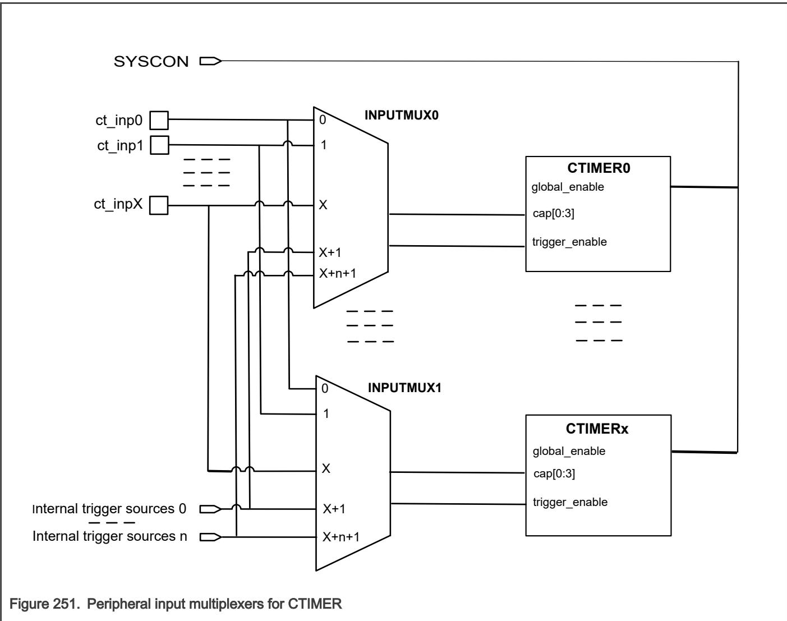

## 48.1.4 External global enable

When the timer is enabled by the CTIMER global start register in SYSCON, (CTIMER Global Start Enable (CTIMERGLOBALSTARTEN)), it is equivalent to writing 1 to the TCR[CEN] bit in CTIMER. The external global start register is used to enable multiple timers at the same time. This operation is allowed by writing a 1 to each Timer’s TCR[AGCEN] bit. If the Timer control register’s CEN bit is already 1, the external global start enable register has no effect (See SYSCON[CTIMERGLOBALSTARTEN]). 

For more information refer CTIMER global start enable register (See SYSCON). 

48.1.5 Peripheral input multiplexers

