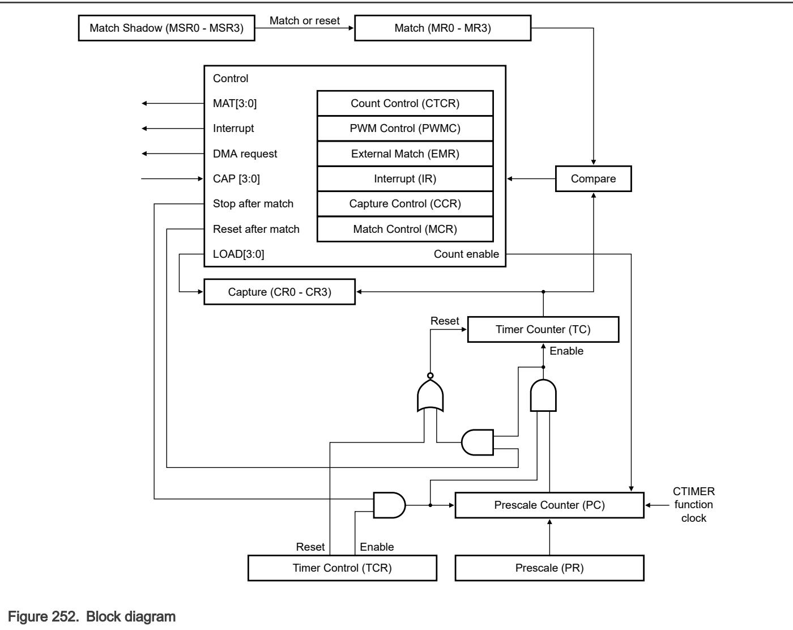

## 48.2 Overview

Each CTIMER is designed to count cycles of the CTIMER function clock or an externally supplied clock. A CTIMER can optionally generate an interrupt or perform other actions at specified timer values based on the settings of Match (MR0 - MR3). Each CTIMER also includes capture input pins (see Capture mode) to capture the timer value when an input signal transitions, optionally generating an interrupt. 

In PWM mode, you can use match registers to provide a single-edge controlled PWM output on the match output pins (see Match mode), and to control the PWM cycle length. All match registers can optionally be auto-reloaded from a companion shadow register (see Match Shadow (MSR0 - MSR3)) whenever the counter is reset to zero. This feature permits modifying the match values for the next counter cycle without disrupting PWM waveforms during the current cycle. When enabled, match reload occurs whenever the counter is reset, either because of a match event or by writing 1 to TCR[CRST]. 

48.2.1 Block diagram

