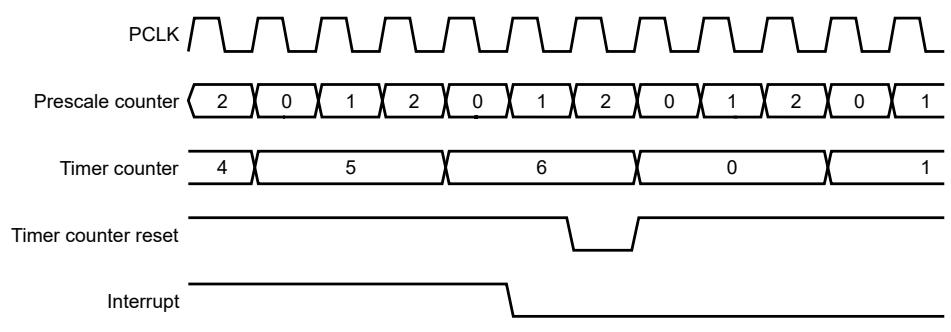
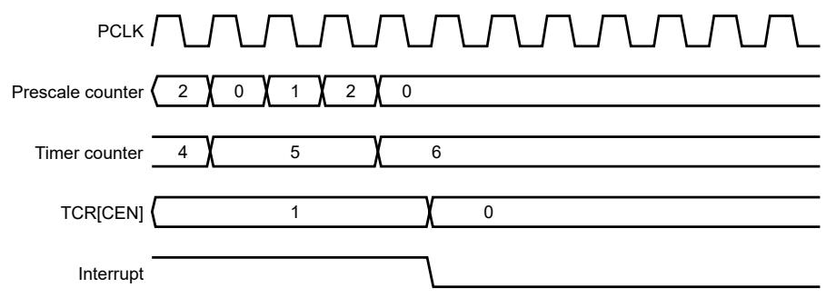

## 48.3 Functional description

Figure 253 shows a timer configured to reset the count and generate an interrupt after a match. The value of Prescale (PR) is 2 and the value of Match (MR0 - MR3) is 6. At the end of the timer cycle where the match occurs, the timer count is reset and gives a full-length cycle to the match value. The interrupt indicating that a match has occurred is generated in the next clock after the timer reaches the match value. 

Figure 253. Timer cycle with PR = 2, MRx = 6, and both interrupt and reset enabled after match

Figure 254 shows a timer configured to stop and generate an interrupt after a match. The value of Prescale (PR) is 2 and the value of Match (MR0 - MR3) is 6. In the next clock after the timer reaches the match value, TCR[CEN] becomes 0 and the interrupt indicating that a match has occurred is generated. 

Figure 254. Timer cycle with PR = 2, MRx = 6, and both interrupt and stop enabled after match

