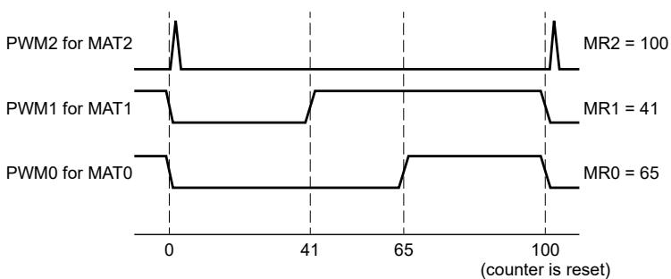

## 48.3.1 Operation sections

All single-edge controlled PWM outputs go low at the beginning of each PWM cycle (timer is set to zero) unless their match value is zero. 

Each PWM output goes high when its match value is reached. If no match occurs (that is, the match value is greater than the PWM cycle length), the PWM output remains continuously low. 

If a match value larger than the PWM cycle length is written to Match (MR0 - MR3), and the PWM signal is already high, the PWM signal is cleared at the start of the next PWM cycle. 

If a match register contains the same value as the timer reset value (the PWM cycle length), the PWM output is reset to low on the next clock tick after the timer reaches the match value. Therefore, the PWM output always consists of one clock tick wide positive pulse with a period that the PWM cycle length determines (that is, the timer reload value). 

If Match (MR0 - MR3) = 0, the PWM output goes high the first time the timer goes back to zero, and remains high continuously. 

The following figure shows sample PWM waveforms with a PWM cycle length of 100 that MR3 specifies and PWM outputs that PWM Control (PWMC) enables. 

## NOTE

When you select match outputs to perform as PWM outputs, you must write 0 to MCR[MRnR] and MCR[MRnS], except to the match register setting the PWM cycle length. For this register, write 1 to MCR[MRnR] to enable the timer reset when the timer value matches the value of the corresponding match register. 

Figure 255. Sample PWM waveforms with a PWM cycle length of 100 (selected by MR3) and MAT3:0 enabled as PWM outputs by the PWM Control register.

