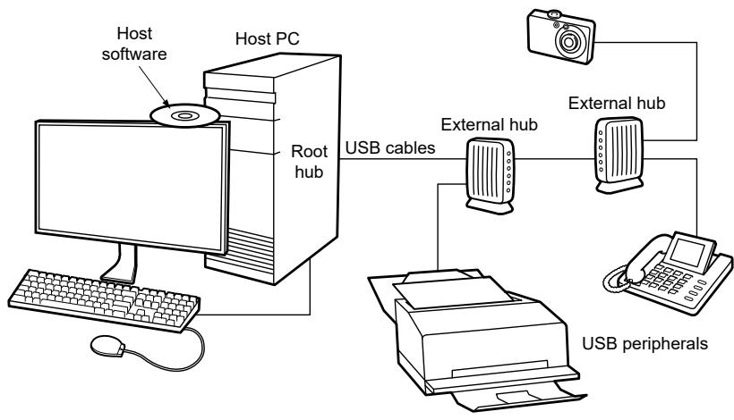

## 61.2.3 USB interface general overview

The USB is a cable bus that supports data exchange between a host computer and a wide range of simultaneously accessible peripherals. The bus allows peripherals to be attached, configured, used, and detached when the host and other peripherals operate. The attached peripherals share USB bandwidth through a host-scheduled, token-based protocol. 

USB software provides a uniform system view for all application software, hiding implementation details to make application software more portable. It manages the dynamic attaching and detaching of peripherals. 

There is only one host in any USB system. The USB interface to the host computer system is referred to as the host controller. 

Any system may have multiple USB devices, such as human interface devices, speakers, printers, etc. USB devices present a standard USB interface regarding comprehension, response, and standard capability. 

The host initiates transactions to specific peripherals, whereas the device responds to control transactions. The device sends and receives data to and from the host using a standard USB data format. USB 2.0 full-speed/low-speed peripherals operate at 12 Mbit/s or 1.5 Mbit/s. 

See the USB 2.0 specification for more information.

Figure 329. Example USB 2.0 system configuration

