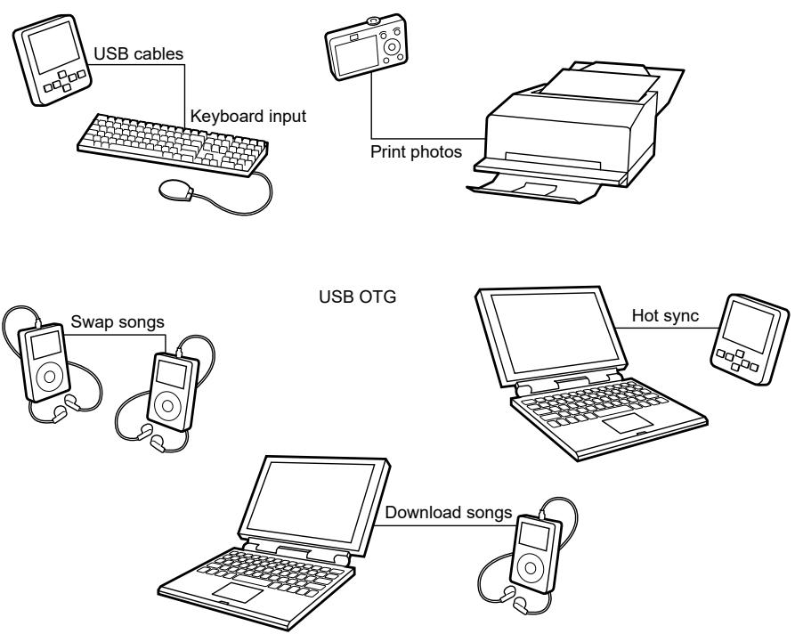

## 61.2.4 USB On-The-Go

USB is a popular standard for connecting peripherals and portable consumer electronic devices such as digital cameras and tablets to host PCs. The OTG Supplement to the USB Specification extends USB to peer-to-peer applications. Using USB OTG technology, consumer electronics, peripherals, and portable devices can connect to exchange data. For example, a digital camera can connect directly to a printer, or a keyboard can connect to a tablet to exchange data. 

With the USB OTG product, you can develop a fully USB-compliant peripheral device that can also assume the role of a USB host. The software determines the role of the device based on hardware signals. It then initializes the device in the appropriate mode of operation (host or peripheral) based on how it is connected. After connecting, the devices can negotiate using the OTG protocols to assume the role of host or peripheral based on the task. 

See the On-The-Go and Embedded Host Supplement to the USB 2.0 Specification for more information. 

Figure 330. Example USB 2.0 On-The-Go configurations

