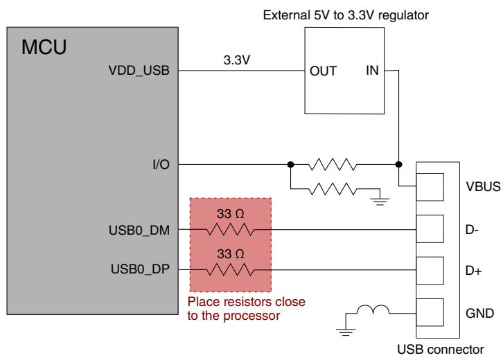
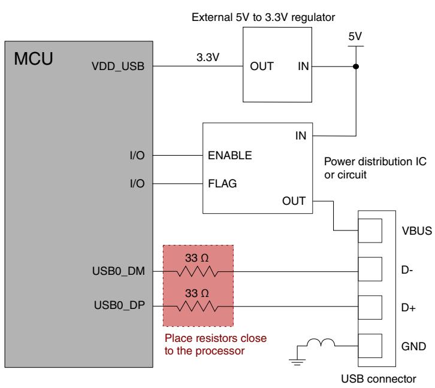
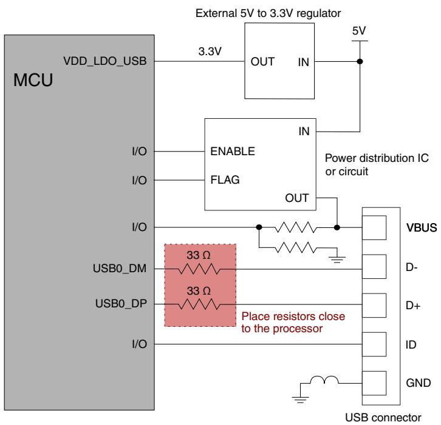

## 61.3.1 On-chip transceiver required external components

USB system operation requires external components to ensure that you have met the driver output impedance, eye diagram, and VBUS cable fault tolerance requirements. DM and DP I/O pads must connect through series resistors (approximately 33 Ω each) to the USB connector on the application printed circuit board (PCB). Additionally, signal quality optimizes when you mount these 33 Ω resistors closer to the processor than the USB board-level connector. The USB transceiver includes the following: 

• An internal 1.5 kΩ pullup resistor on the USB_DP line for the full-speed device (CONTROL[DPPULLUPNONOTG] or OTGCTL[DPHIGH] controls). 

• Internal 15 kΩ pulldown resistors on the USB_DP and USB_DM signals, primarily intended for Host mode operation, are also useful in Device mode, as explained below. 

## NOTE

For device operation, you must enable the internal 15 kΩ pulldowns to keep the DP and DM ports in a known quiescent state when the VBUS detection software determines that the USB connection is not activated. It also includes cases when no cable to a host is present or the USB port is not used. USBCTRL[PDE] must control the internal 15 kΩ pulldowns in this case. 

For host operation, the internal 15 kΩ pulldowns enable automatically, as the USB 2.0 specification requires when CTL[HOSTMODEEN] is asserted high. 

The following diagrams provide overviews of device-only, host-only, and dual-role connections. See Kinetis Peripheral Module , available on www.nxp.com, for more information. 

Figure 331. Typical Device-only block diagram (bus-powered with external regulator)

Figure 332. Host-only diagram with external regulator

Figure 333. Dual-role diagram with external regulator

