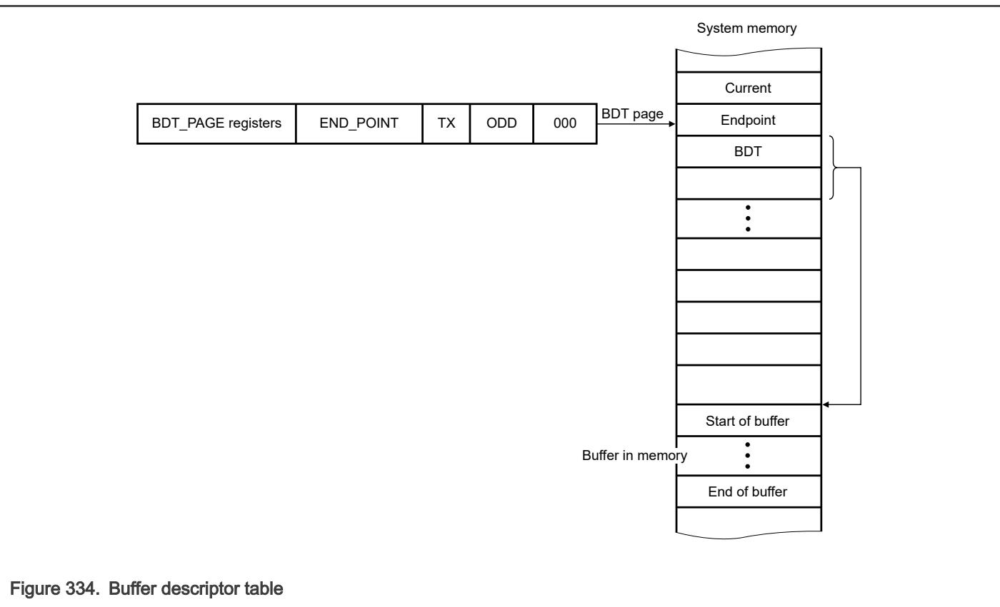

## 61.3.2.1 Buffer descriptor table (BDT)

The device operation's function is to transfer a request in the memory image to and from the USB. USBFS implements a BDT to manage USB endpoint communications in system memory efficiently. 

• The BDT resides on a 512-byte boundary in system memory and is pointed to by the BDT page registers. 

• Every endpoint direction requires two 8-byte buffer descriptor (BD) entries. 

Therefore, a system with 16 fully bidirectional endpoints requires 512 bytes of system memory to implement the BDT. The two BD entries allow for an EVEN BD and ODD BD entry for each endpoint direction, which enables the microprocessor to process one BD while USBFS is processing the other BD. Double buffering BDs allow USBFS to transfer data easily at the maximum throughput provided by USB. 

You must manage buffers for USBFS by updating the BDT when needed. This allows USBFS to efficiently manage data transmission and reception while the microprocessor performs communication overhead processing and other functiondependent applications. 

Because the buffers are shared between the microprocessor and USBFS, a simple semaphore mechanism distinguishes who is allowed to update the BDT and buffers in system memory. A semaphore (the OWN field) becomes 0 when the microprocessor owns the BD entry 

• When OWN = 0, the microprocessor is allowed read and write access to the BD entry and the buffer in system memory. 

• When OWN = 1, USBFS owns the BD entry and the buffer in system memory. USBFS now has full read and write access, and the microprocessor must not modify the BD or its corresponding data buffer. 

The BD also contains indirect address pointers where the actual buffer resides in system memory. The following diagram shows this indirect address mechanism. 

