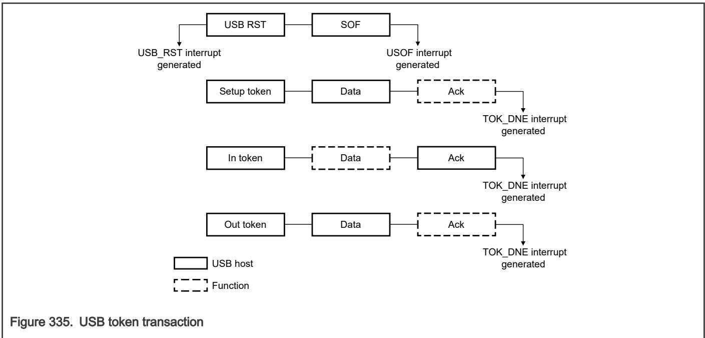

## 61.3.2.4 USB transaction

When USBFS transmits or receives data, it computes the BDT address using the address generation shown in Addressing BDT entries. 

If OWN = 1, then the following process occurs: 

1. USBFS reads the BDT. 

2. The SIE transfers the data via the DMA to or from the buffer pointed to by Address (ADDR) of the BD. 

3. When the TOKEN completes, USBFS updates the BDT, and if KEEP = 0, then USBFS changes the OWN field to 0. 

4. Update the STAT register, and the TOK_DNE interrupt occurs. 

5. When the processor processes the TOK_DNE interrupt, it reads from the status register all the information required to process the endpoint. 

6. At this point, the processor allocates a new BD so that you can transmit or receive the additional USB data for that endpoint and then processes the last BD. 

The following figure shows how a typical USB token is processed after the BDT is read and OWN = 1. 

USB has two sources for the DMA overrun error: 

• Memory latency: The memory latency may be too high and cause the receive FIFO to overflow. This is predominantly a hardware performance issue, usually caused by transient memory access issues. 

• Oversized packets: The packet received may be larger than the negotiated MaxPacket size. Typically, a software bug causes this. The USB specification is ambiguous for DMA overrun errors due to oversized data packets because it assumes correct software drivers on both sides. NAKing the packet can result in the retransmission of the already oversized packet data. Therefore, in response to oversized packets, the USB core continues ACKing the packet for non-isochronous transfers. 

Table 479. USB responses to DMA overrun errors

<table><tr><td>Errors due to memory latency</td><td>Errors due to oversized packets</td></tr><tr><td>Non-acknowledgment (NAK) or bus timeout (BTO) — See bit 4 in Error Interrupt Status (ERRSTAT) as appropriate for the class of transaction.</td><td>Continues acknowledging (ACKing) the packet for non-isochronous transfers.</td></tr><tr><td>—</td><td>Clip the data written to memory to the MaxPacket size so as not to corrupt system memory.</td></tr><tr><td>ERRSTAT[DMAERR] becomes 1 for Host mode and Device mode of operation. Depending on the INTENB and ERRENB register&#x27;s values, the core may assert an interrupt to notify the processor of the DMA error.</td><td>Asserts ERRSTAT[DMAERR], which can trigger an interrupt and ISTAT[TOKDNE] fires.The TOK_PID field of the BDT is not 1111 because the DMAERR is not due to latency.</td></tr><tr><td>In Host mode: Generate ISTAT[TOKDNE] and the TOK_PID field of the BDT is 1111 to indicate the DMA latency error. Host mode software can decide to retry or move to next scheduled item.In Device mode: The BDT is not written back nor ISTAT[TOKDNE] triggered because it is assumed that a second attempt is queued and will succeed in the future.</td><td>The packet length field written back to the BDT is the MaxPacket value representing the length of the clipped data written to memory.</td></tr><tr><td colspan="2">From here, you can decide an appropriate course of action for future transactions, such as stalling the endpoint, canceling the transfer, disabling the endpoint, and others.</td></tr></table>
