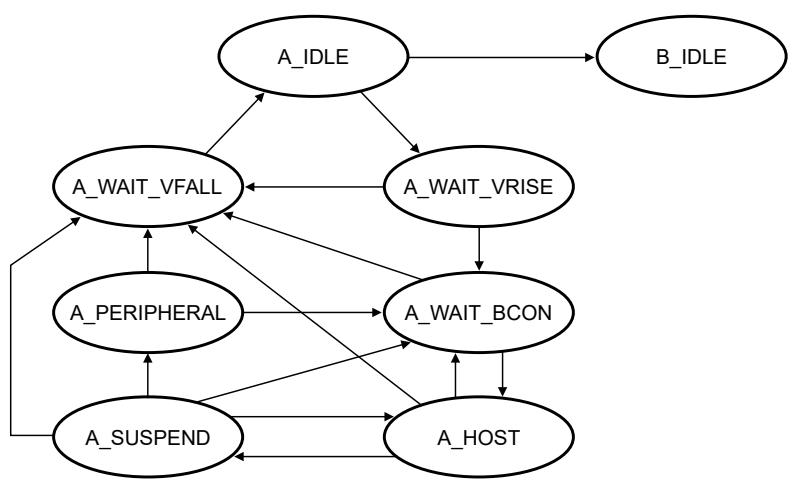

## 61.6.4.1 OTG dual role A device operation

A device is considered the A device: 

• According to the type of cable attached. 

• If you plug in the USB Type Standard-A or Micro-A plug into the device. 

The following flow diagram and state description table show how a dual role A device operates: 

Figure 336. Dual role A device flow diagram

Table 484. State descriptions for the dual role A device flow

<table><tr><td>State</td><td>Possible events in this state</td><td>Event response</td></tr><tr><td rowspan="2">A_IDLE</td><td>An ID<eq>interrupt^1</eq> occurs, indicating that the cable has been unplugged, or a Type B cable is attached. The device now acts as a Type B device.</td><td>Go to B_IDLE.</td></tr><tr><td>The A application wants to use the bus or the B device is doing an SRP (as A_SESS_VLD interrupt or Attach or Port status change interrupt indicates).</td><td>Go to A_WAIT_VRISE.Turn on DRV_VBUS.Check the data line for 5-10 ms pulsing.</td></tr><tr><td rowspan="2">A_WAIT_VRISE</td><td>An ID<eq>interrupt^1</eq> occurs or if A_VBUS_VLD is false after 100 msec, indicating that the cable is changed or the A device cannot support the current required from the B device.</td><td>Go to A_WAIT_VFALL.Turn off DRV_VBUS.</td></tr><tr><td>An A_VBUS_VLD interrupt occurs</td><td>Go to A_WAIT_BCON.</td></tr><tr><td rowspan="2">A_WAIT_BCON</td><td>200 ms pass without an Attach or ID interrupt<eq>^{1}</eq> (this could wait forever if desired)</td><td>Go to A_WAIT_FALL.Turn off DRV_VBUS.</td></tr><tr><td>An A_VBUS_VLD interrupt occurs and a B device attaches</td><td>Go to A_HOST.Enter Host mode.</td></tr><tr><td rowspan="4">A_HOST</td><td>Enumerate the device to determine OTG support. Then one of the following occurs:</td><td></td></tr><tr><td>An A_VBUS_VLD interrupt occurs.A device has finished its session and does not need the bus anytime soon.The B device disconnects.</td><td>Go to A_WAIT_VFALL.Exit Host mode.Turn off DRV_VBUS.</td></tr><tr><td>One of the following occurs:The A device finishes its session.The A device relinquishes the bus to the B device.</td><td>Go to A_SUSPEND.</td></tr><tr><td>An ID interrupt<eq>^{1}</eq> occurs or if the B device disconnects.</td><td>Go to A_WAIT_BCON.</td></tr><tr><td rowspan="3">A_SUSPEND</td><td>An ID interrupt<eq>^{1}</eq> occurs, or if a 150 ms B disconnect timeout occurs (this timeout value could be longer), or if an A_VBUS_VLD interrupt occurs.</td><td>Go to A_WAIT_VFALL.Turn off DRV_VBUS.</td></tr><tr><td>HNP is enabled, and B disconnects in 150 ms, then B device becomes the host.</td><td>Go to A_PERIPHERAL.Exit Host mode.</td></tr><tr><td>The A device wants to start another session.</td><td>Go to A_HOST.</td></tr><tr><td rowspan="2">A_PERIPHERAL</td><td>An ID interrupt<eq>^{1}</eq> or A_VBUS_VLD interrupt occurs.</td><td>Go to A_WAIT_VFALL.Turn off DRV_VBUS.</td></tr><tr><td>The bus is idle for 3-200 ms.</td><td>Go to A_WAIT_BCON.Enter Host mode.</td></tr><tr><td>A_WAIT_VFALL</td><td>An ID interrupt<eq>^{1}</eq> occurs or (A_SESS_VLD or a B device connects)</td><td>Go to A_IDLE.</td></tr></table>

1. ID interrupt is triggered due to a detected change in the resistance between the local USB connector ID pin and ground. 

