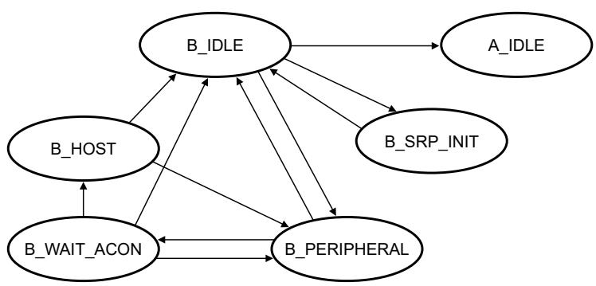

## 61.6.4.2 OTG dual role B device operation

A device is considered a B device if you connect it to the bus with a USB type Standard-B, Mini-B, or Micro-B plug inserted into the local USB receptacle. The type Mini-B plug and receptacle are now only allowed for dedicated peripheral devices and not allowed for a dual role or OTG devices. 

The following flow diagram and state description table show how a dual role B device operates: 

Figure 337. Dual role B device flow diagram

Table 485. State descriptions for the dual role B device flow

<table><tr><td>State</td><td>Possible events in this state</td><td>Event response</td></tr><tr><td rowspan="3">B_IDLE</td><td>An ID<eq>interrupt^1</eq> occurs, indicating that a Type A cable is plugged in. The device must now respond as a type A device.</td><td>Go to A_IDLE.</td></tr><tr><td>A B_SESS_VLD interrupt occurs, and the A device has turned on VBUS and begins a session.</td><td>Go to B_PERIPHERAL.Turn on DP_HIGH.</td></tr><tr><td>A B application wants the bus and the bus is idle for 2 ms, and B_SESS_END becomes 1, then the B device can perform an SRP.</td><td>Go to B_SRP_INIT.Pulse CHRG_VBUS Pulse.DP_HIGH 5-10 ms.</td></tr><tr><td>B_SRP_INIT</td><td>One of the following occurs:An ID<eq>interrupt^1</eq>The B device completes initiating SRP</td><td>Go to B_IDLE.</td></tr><tr><td>B_PERIPHERAL</td><td>HNP is enabled and the bus is suspended, and the B device wants the bus, B can become the host.</td><td>Go to B_WAIT_ACON.Turn off DP_HIGH.</td></tr><tr><td rowspan="3">B_WAIT_ACON</td><td>An A device connects, and an attach interrupt is received.</td><td>Go to B_HOST.Exit Host Mode.</td></tr><tr><td>An ID<eq>interrupt^1</eq> or B_SESS_VLD interrupt occurs.The cable changes or VBUS goes away, the host does not support it.</td><td>Go to B_IDLE.</td></tr><tr><td>3.125 ms expires or a Resume occurs</td><td>Go to B_PERIPHERAL.</td></tr><tr><td rowspan="2">B_HOST</td><td>An ID<eq>interrupt^1</eq> or B_SESS_VLD interrupt occurs.The cable changes or if VBUS goes away, then the host does not support it.</td><td>Go to B_IDLE.</td></tr><tr><td>B application is done or the A device disconnects.</td><td>Go to B_PERIPHERAL.</td></tr></table>

1. An ID interrupt is triggered due to a detected change in the resistance between the local USB connector ID pin and ground. 

