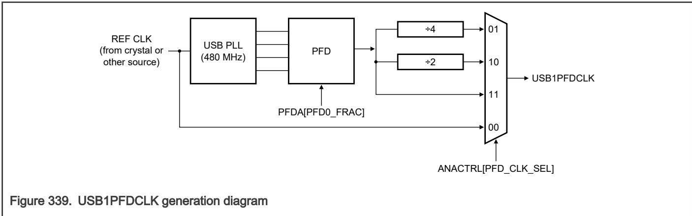

## 62.3.1 Operation

UTMI provides a 16-bit interface to the USB controller. This interface is clocked at 30 MHz to match the controller instance on the chip: 

• The digital portion of USBPHY includes: 

— UTMI interface and control and status logic 

— Digital transmitter 

— Digital receiver 

— Programmable registers 

• The analog transceiver section includes the following for all three USB 2.0 signaling speeds, as shown in Figure 340: 

NOTE

— Analog receiver 

— Analog transmitter 
