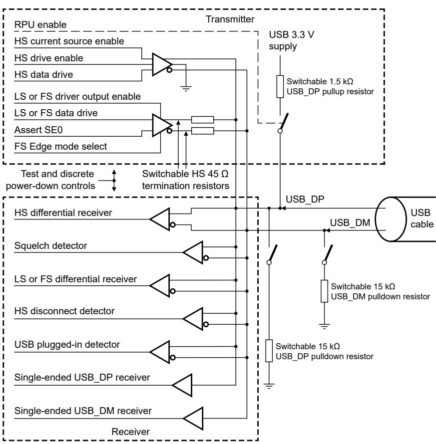

## 62.3.1.4 Analog receiver

The analog receiver comprises five differential receivers, two single-ended receivers, and a 9X, 480 MHz HS data sampling module , as shown in Figure 340 and described further in this section. 

Figure 340. Analog transceiver block diagram

