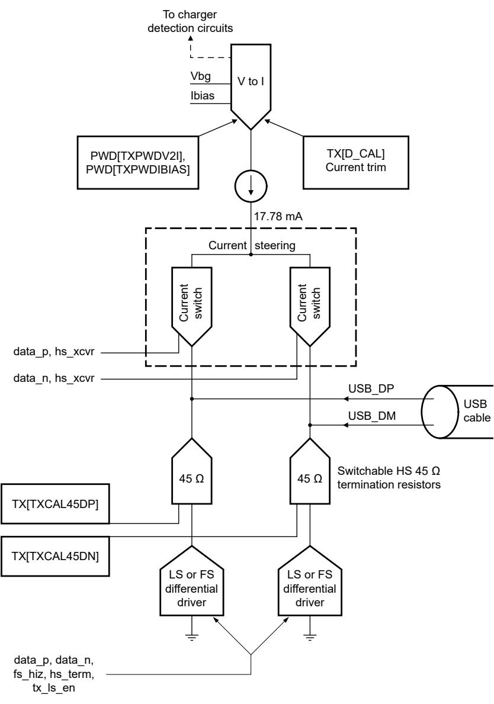

## 62.3.1.5.5 Switchable 15 kΩ USB_DP and USB_DM pulldown resistors

USBPHY provides switchable 15 kΩ pulldown resistors on both USB_DP and USB_DM signals. They are enabled in Host mode to indicate to the device controller on the far end of the USB connection that a host is present. These resistors are also used during certain battery charging detector functions. 

Figure 341. USBPHY transmitter block diagram

