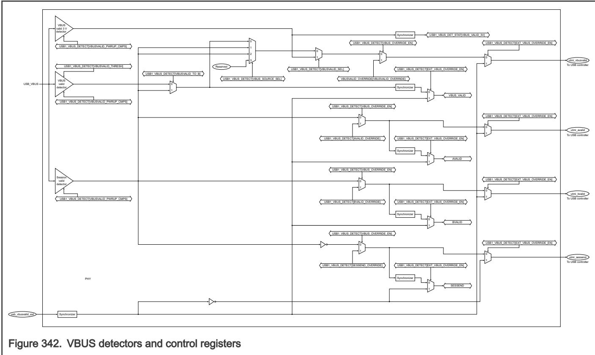

## 62.6.1 VBUS detector

USBPHY has three separate VBUS detectors, which you can individually power on or off using USB1_VBUS_DETECT[VBUSVALID_PWRUP_CMPS]. For power efficiency, align the USB software to the desired use case and either enable only one detector (if an internal detector is desired) or none of them (if an external detector is desired). 

All three detectors have observable status fields in VBUS Detect Status (USB1_VBUS_DET_STAT), and to accomplish software overrides. Use the usb_vbusvalid_ext signal as a hardware override. 

USB1_VBUS_DET_STAT[VBUS_VALID] is often used in Host mode; it is the most accurate and has a programmable threshold that USB1_VBUS_DETECT[VBUSVALID_THRESH] defines. 

A session valid detector is often used in Device mode and may be useful in systems using nonstandard VBUS voltages. 

You can use USB1_VBUS_DET_STAT[VBUS_VALID_3V] in Host mode, which has a lower threshold for the voltage on the USB1_VBUS pin than either the session valid detector or USB1_VBUS_DET_STAT[VBUS_VALID]. It may be useful for applications that provide a nonstandard VBUS voltage to USBPHY. 

