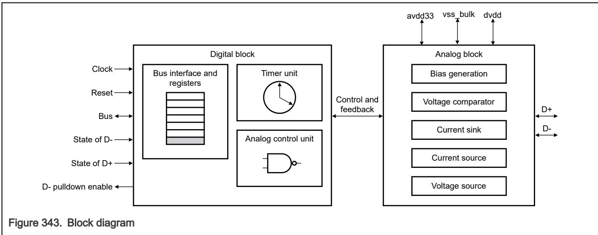

## 63.2.1 Block diagram

The following figure is a high-level block diagram of the module. 

USBDCD consists of two main blocks:

• A Digital block provides the programming interface (memory-mapped registers) and includes the Timer unit and the Analog control unit. 

• An Analog block provides the circuitry for the physical detection of the charger that includes the Bias generation, Voltage source, Current source, Current sink, and Voltage comparator circuitry. This block also contains necessary muxes between the source/sink circuits and the D- and D+ pins. 
