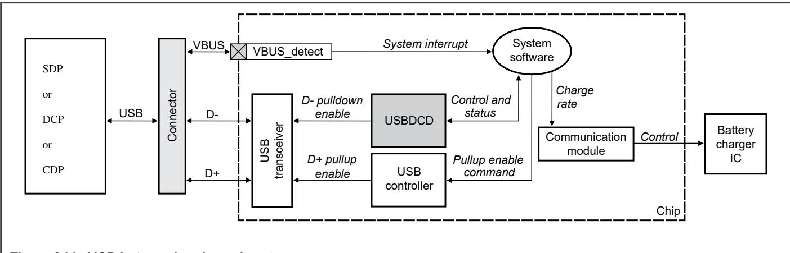

## 63.3 Functional description

Several hardware components are involved in the sequence of detecting the presence of the charging port and type of the charging port. System software coordinates this activity. This collection of interacting hardware and software is called USB battery charging subsystem. The following figure shows USBDCD as a component of the subsystem. 

Figure 344. USB battery charging subsystem

The following table describes the components. 

Table 495. USB battery charger subsystem components

<table><tr><td>Component</td><td colspan="2">Description</td></tr><tr><td rowspan="6">Battery Charger IC</td><td colspan="2">The external battery charger IC regulates the charge rate to the rechargeable battery. System software is responsible for communicating the appropriate charge rates.</td></tr><tr><td>Charger</td><td>Maximum current drawn</td></tr><tr><td>Standard Downstream Port (SDP)</td><td>up to 500 mA (<eq>I_{CFG\_MAX}</eq>)<eq>^{1}</eq></td></tr><tr><td>CDP</td><td>up to 1500 mA (<eq>I_{DEV\_CHG}</eq>)</td></tr><tr><td>DCP</td><td>up to 1500 mA (<eq>I_{DEV\_CHG}</eq>)</td></tr><tr><td colspan="2">1. If a USB SDP host has suspended the USB device, the current drawn by the device has to follow the rules of the Dead Battery Provision in theUSB Battery Charging Specification,Rev. 1.2.</td></tr><tr><td>Comm Module</td><td colspan="2">A communications module on the device can be used to control the charge rate of the battery charger IC.</td></tr><tr><td>System software</td><td colspan="2">Coordinates the detection activities of the subsystem.</td></tr><tr><td>USB Controller</td><td colspan="2">The D+ pullup enable control signal plays a role during the charger type detection phase. System software must issue a command to the USB controller to assert this signal. After this pullup is enabled, the device is considered to be connected to the USB bus. The host then attempts to enumerate it.NOTEIn general, the USB controller is used only for USB device applications when using most features of USBDCD. The exception is for USB host applications which need to advertise CDP capability. SeeHost Mode CDP advertisement signaling. Otherwise, USBDCD must be disabled in host mode.</td></tr><tr><td>USB Transceiver</td><td colspan="2">The USB transceiver contains the pullup resistor for the USB D+ signal and the pulldown resistors for the USB D+ and D- signals. The D+ pullup and the D- pulldown are both used during the charger detection sequence in BC1.1, but it is not used during charger detection in BC1.2. The USB transceiver also outputs the digital state of the D+ and D- signals from the USB bus.The pullup and pulldown enable signals are controlled by other modules during the charger detection sequence in BC1.1: The D+ pullup enable is output from the USB controller and is under software control. USBDCD controls the D- pulldown enable.</td></tr><tr><td>USBDCD</td><td colspan="2">Detects whether the device has been plugged into either an SDP, a CDP, or a DCP.</td></tr><tr><td>VBUS_detect</td><td colspan="2">This interrupt pin connected to the USB VBUS signal detects when the device has been plugged into or unplugged from the USB bus. If the system requires waking up from a low-power mode on being plugged into the USB port, this interrupt should also be a low-power wakeup source. If this pin multiplexes other functions, such as GPIO, the pin can be configured as an interrupt so that the USB plug or unplug event can be detected.</td></tr></table>
