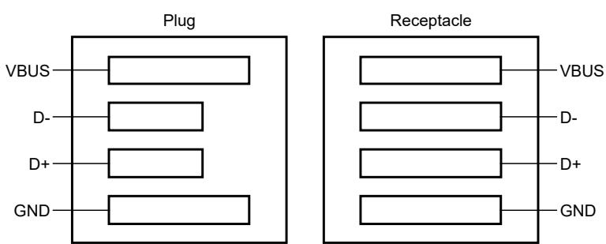

## 63.3.2.3 Data pin contact detection

The module must ensure that the data pins have made contact because the detection sequence depends upon the state of the USB D+ and D- signals. USB plugs and receptacles are designed such that when the plug is inserted into the receptacle, the power pins make contact before the data pins make contact. See the following figure. 

Figure 347. Relative pin positions in USB plugs and receptacles

As a result, when a portable USB device is attached to an upstream port, the portable USB device detects VBUS before the data pins have made contact. The time between power pins and data pins making contact depends on how fast the plug is inserted into the receptacle. Delays of several hundred milliseconds are possible. 
