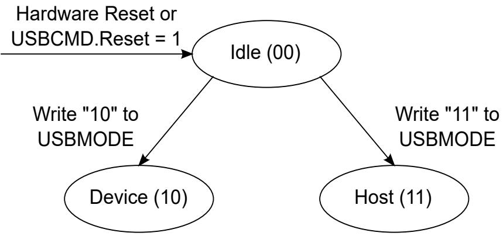

## 64.6.1.3.1 Register bits

In the previous section, the Register interface has behaviors described for device mode and behaviors described for host mode. However, for OTG operations it is necessary to perform tasks independent of the controller mode. 

NOTE 

The only way to transit the controller mode out of host or device mode is with the controller reset bit. Therefore, it is also necessary for the OTG tasks to be performed independent of a controller reset as well as independent of the controller mode. 

The following figure shows the controller mode. 

Figure 349. Controller Mode

To this end, listed below are the register bits that are used for OTG operations, which are independent of the controller mode and are also not affected by a write to the reset bit in the USBCMD register: 

All Identification Registers 

All Device/Host Capability Registers 

## OTGSC: All bits

## PORTSC1:

• Physical Interface Select 

• Physical Interface Serial Select 

• Physical Interface Data Width 

• Physical Interface Low Power 

• Physical Interface Wake Signals 

• Port Indicators 

• Port Power 
