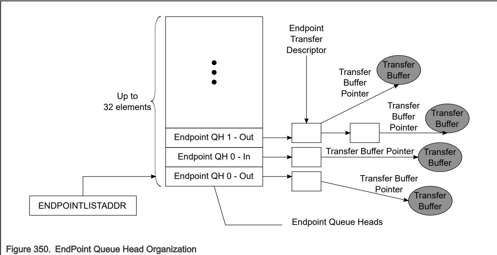

## 64.6.5 Device data structures

This section defines the interface data structures used to communicate control, status, and data between Device Controller Driver (DCD) Software and the Device Controller. 

The data structure definitions in this chapter support a 32-bit memory buffer address space. The interface consists of device Queue Heads and Transfer Descriptors. 

NOTE 

Software must ensure that no interface data structure reachable by the Device Controller spans a 4Kpage boundary. 

The data structures defined in the chapter are (from the device controller's perspective) a mix of read-only and read/ writable fields. The device controller must preserve the read-only fields on all data structure writes. 

The figure below shows the organization of the EndPoint Queue Head. 

Endpoint queue heads are arranged in an array in a continuous area of memory pointed to by the USB.ENDPOINTLISTADDR pointer. The even-numbered device queue heads in the list support receive endpoints (OUT/SETUP) and the odd-numbered queue heads in the list are used for transmit endpoints (IN/INTERRUPT). That is, the device queue heads in the list with even offset support receiver endpoints (OUT) and the queue heads in the list with odd offset are used for transmit endpoint(IN). The device controller will index into this array based upon the endpoint number received from the USB bus. All information necessary to respond to transactions for all primed transfers is contained in this list so the Device Controller can readily respond to incoming requests without having to traverse a linked list. 

## NOTE

The Endpoint Queue Head List must be aligned to a 2k boundary. 
