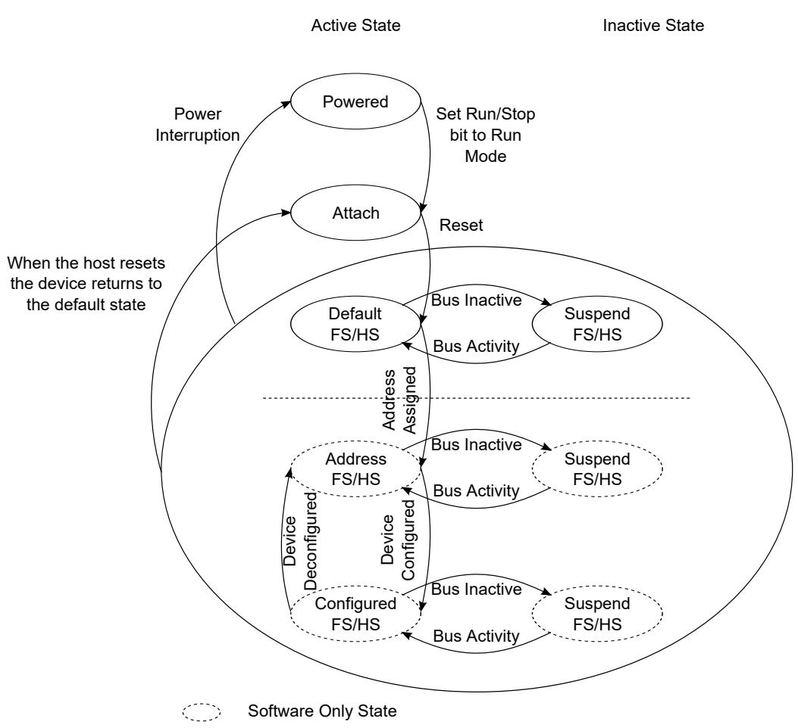

## 64.6.6.1 Port state and control

After receiving a reset on the bus, the port will enter the defaultFSordefaultHS state in accordance with the reset protocol described in Appendix C.2 of the USB Specification Rev. 2.0. 

The following state diagram depicts the state of a USB 2.0 device. 

From a chip or system reset, the device controller enters the powered state. A transition from the powered state to the attachstate occurs when the Run/Stop bit is set to a '1'. 

Figure 351. Device State Diagram

States powered attach defaultFS/HS suspendFS/HS are implemented in the device controller and are communicated to the DCD using the following status bits: 

The following table describes the Device Controller State Information Bits. 

Table 526. Device Controller State Information Bits

<table><tr><td>Bit</td><td>Register</td></tr><tr><td>DCSuspend</td><td>USBSTS</td></tr><tr><td>USB Reset Received</td><td>USBSTS</td></tr><tr><td>Port Change Detect</td><td>USBSTS</td></tr><tr><td>High-Speed Port</td><td>PORTSC1</td></tr></table>

It is the responsibility of the DCD to maintain a state variable to differentiate between the DefaultFS/HS state and the Address/ states. Change of state from to  and the  states is part of the enumeration process described in the device framework section of the USB 2.0 Specification. 

As a result of entering the Address state, the device address register (DEVICEADDR) must be programmed by the DCD. 

Entry into the Configured indicates that all endpoints to be used in the operation of the device have been properly initialized by programming the USB_UOG_ENDPTCTRLx registers and initializing the associated queue heads. 
