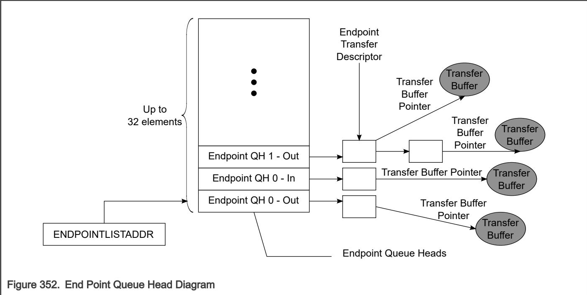

## 64.6.6.4 Managing queue heads

The following figure shows the End Point Queue Head. 

The device queue head (dQH) points to the linked list of transfer tasks, each depicted by the device Transfer Descriptor (dTD). An area of memory pointed to by USB.ENDPOINTLISTADDR contains a group of all dQH's in a sequential list as shown in Figure 352. The even elements in the list of dQH's are used for receive endpoints (OUT/SETUP) and the odd elements are used for transmit endpoints (IN/INTERRUPT). Device transfer descriptors are linked head to tail starting at the queue head and ending at a terminate bit. Once the dTD has been retired, it will no longer be part of the linked list from the queue head. Therefore, software is required to track all transfer descriptors because pointers will no longer exist within the queue head once the dTD is retired (see section Software link pointers). 

In addition to the current and next pointers and the dTD overlay examined in section Operational model for packet transfers, the dQH also contains the following parameters for the associated endpoint: Multiplier, Maximum Packet Length, Interrupt On Setup. The complete initialization of the dQH including these fields is demonstrated in the next section. 
