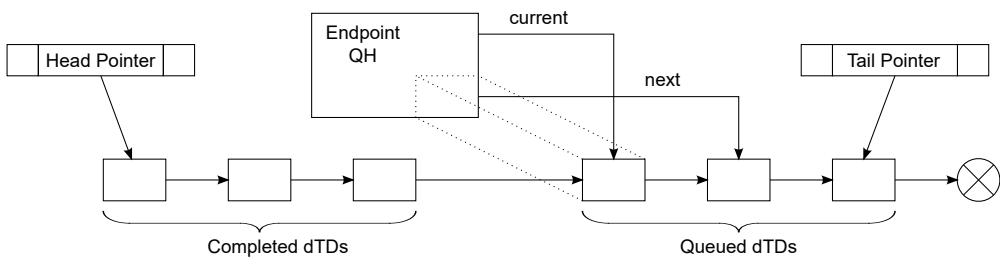

## 64.6.6.5.1 Software link pointers

It is necessary for the DCD software to maintain head and tail pointers to the for the linked list of dTDs for each respective queue head. 

This is necessary because the dQH only maintains pointers to the current working dTD and the next dTD to be executed. The operations described in next section for managing dTD will assume the DCD can use reference the head and tail of the dTD linked list. The following figure shows the Software Link Pointers. 

Figure 353. Software Link Pointers

## NOTE

To conserve memory, the reserved fields at the end of the dQH can be used to store the Head & Tail pointers, but it still remains the responsibility of the DCD to maintain the pointers. 
